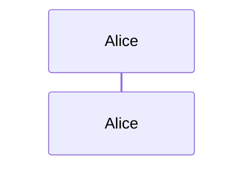
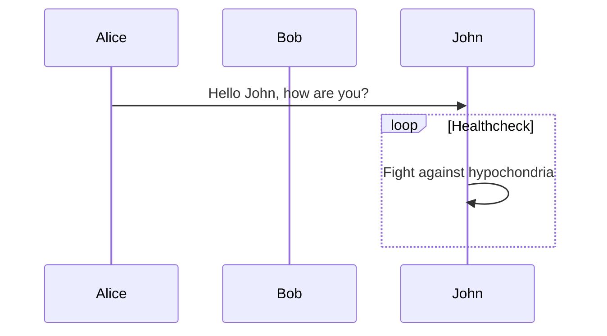
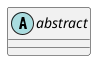
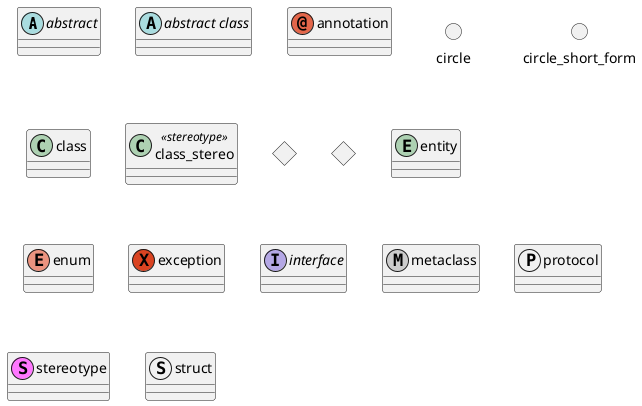

## Overview

The `PreviewableCode` component enhances code block rendering by providing an interactive tabbed interface for previewable content. It automatically detects special code blocks (like diagrams) and renders them appropriately, while falling back to standard code display for regular code blocks.

## Implementation

To use the `PreviewableCode` component:

1. Replace the default `<Pre>` component with `<PreviewableCode>`
2. Configure the `renderers` prop to include your desired components (e.g., Mermaid and PlantUML)

Here's how to set it up in your MDX components:

```diff
+++ b/components/MDXComponents.tsx
@@ -1,16 +1,25 @@
 import TOCInline from 'pliny/ui/TOCInline'
-import Pre from 'pliny/ui/Pre'
+// import Pre from 'pliny/ui/Pre'
 import BlogNewsletterForm from 'pliny/ui/BlogNewsletterForm'
 import type { MDXComponents } from 'mdx/types'
 import Image from './Image'
 import CustomLink from './Link'
 import TableWrapper from './TableWrapper'
+import PreviewableCode from './PreviewableCode'
+import Mermaid from './Mermaid'
+import PlantUML from './PlantUML'
+
+// Configure available renderers
+const renderers = {
+  mermaid: Mermaid,
+  plantuml: PlantUML,
+}
 
 export const components: MDXComponents = {
   Image,
   TOCInline,
   a: CustomLink,
-  pre: Pre,
+  pre: (props) => <PreviewableCode defaultView={'code'} renderers={renderers} {...props} />,
   table: TableWrapper,
   BlogNewsletterForm,
 }
```

## Usage Examples

### Mermaid Diagrams
Mermaid is a widely used diagramming tool that supports various diagram types, including sequence diagrams, flowcharts, and Gantt charts.  

The `<Mermaid>` component is used to render Mermaid diagrams. Under the hood, it utilizes `mermaid.js` to generate the diagrams as SVGs directly in the client’s browser.

````markdown

````




### PlantUML Diagrams
PlantUML is a widely used diagramming tool that supports various diagram types, including sequence diagrams, flowcharts, and Gantt charts. Since the PlantUML rendering engine is written in Java and operates on the server side, it cannot generate diagrams directly in the browser.

The `<PlantUML>` component is used to display PlantUML diagrams in the browser. It utilizes `plantuml-encoder` to Base64 encode the diagram code and sends it to `https://www.plantuml.com/plantuml/img/{base64encode(text)}` for rendering. 

The resulting image is then displayed within the component, which may take a few seconds to load. Additionally, the component provides a clickable link to the SVG image, which opens in a new tab when clicked. 

> [!NOTE]
> plantuml.com also provides a svg rendering endpoint, but it cannot be embedded in the component as for the cross-origin policy.

````markdown

````


